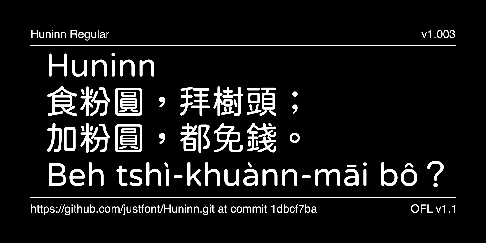

# Huninn / 粉圓

[![][Fontbakery]](https://justfont.github.io/Huninn/fontbakery/fontbakery-report.html)
[![][Universal]](https://justfont.github.io/Huninn/fontbakery/fontbakery-report.html)
[![][GF Profile]](https://justfont.github.io/Huninn/fontbakery/fontbakery-report.html)
[![][Shaping]](https://justfont.github.io/Huninn/fontbakery/fontbakery-report.html)

[Fontbakery]: https://img.shields.io/endpoint?url=https%3A%2F%2Fraw.githubusercontent.com%2Fjustfont%2FHuninn%2Fgh-pages%2Fbadges%2Foverall.json
[GF Profile]: https://img.shields.io/endpoint?url=https%3A%2F%2Fraw.githubusercontent.com%2Fjustfont%2FHuninn%2Fgh-pages%2Fbadges%2FGoogleFonts.json
[Outline Correctness]: https://img.shields.io/endpoint?url=https%3A%2F%2Fraw.githubusercontent.com%2Fjustfont%2FHuninn%2Fgh-pages%2Fbadges%2FOutlineCorrectnessChecks.json
[Shaping]: https://img.shields.io/endpoint?url=https%3A%2F%2Fraw.githubusercontent.com%2Fjustfont%2FHuninn%2Fgh-pages%2Fbadges%2FShapingChecks.json
[Universal]: https://img.shields.io/endpoint?url=https%3A%2F%2Fraw.githubusercontent.com%2Fjustfont%2FHuninn%2Fgh-pages%2Fbadges%2FUniversal.json

Huninn (粉圓) is an open-source Traditional Chinese rounded typeface project developed by justfont. 

This project was initiated as a way to give back to the community following the success of the 2015 crowdfunding campaign for [JinXuan](https://blog.justfont.com/2025/03/jinxuan-en/). As promised, an open-source font optimized for Taiwanese users was created and given as a gift to the Taiwanese community. 

The typeface is based on the Japanese existing open-source font [Kosugi Maru](https://github.com/googlefonts/kosugi-maru), originally developed by Motoya Co., Ltd and the Latin characters were replaced with another open-source font, [Varela Round](https://fonts.google.com/specimen/Varela+Round), designed by Joe Prince and Avraham Cornfeld, to ensure a cohesive and high-quality bilingual experience. The name **粉圓 (Huninn)** is inspired by the Taiwanese term for tapioca pearls, reflecting a playful nod to local culture. 

Huninn includes commonly used characters in Taiwan, Zhuyin (Bopomofo) symbols, and even adds Taigi and Hokkien phonetic symbols and characters to meet local requirements.

Released under the SIL Open Font License 1.1 (OFL 1.1), Huninn is freely available for anyone to use without restrictions. It can be downloaded and used at no cost, with no requirement to notify or credit us. It is also suitable for commercial projects, as long as the typeface itself is not sold as a standalone product. Users are free to copy, distribute, and install it on any device or software without limitations. Additionally, the typeface can be modified or used as the basis for new works, provided that any derivatives are shared under the same SIL Open Font License.

Learn more about the Huninn typeface story from [Huninn: A Free and Open-Source Font for Traditional Chinese](https://blog.justfont.com/2025/03/huninn-open-source-en/).

## Features

The design process involved reworking the original Kosugi Maru font, which featured uneven stroke weights and a distinctly Japanese aesthetic, to better suit Taiwanese typographic tastes. Additionally, justfont enhanced the font’s grayscale rendering and repositioned punctuation to conform to Traditional Chinese standards, improving its practicality for local uses such as documents, web design, and signage.

- **Glyph Expansion**: Building on this base, justfont tailored the font for everyday use in Taiwan. They expanded it by incorporating 1,477 frequently used Traditional Chinese characters, Taiwanese-specific phonetic symbols like Bopomofo , and characters for Taiwanese Hokkien Romanization (Tai-lo). In total, our team refined glyph shapes and added over 2,700 characters and symbols to better reflect common usage in Taiwan.
- **Design Refinements**: The character designs were polished to enhance legibility and visual balance. This included fine-tuning stroke weights, adjusting character spacing, and optimizing glyph proportions for a typeface that is both practical and aesthetically pleasing. Significant effort went into refining the “grayscale” of the characters, addressing the original’s inconsistent stroke thicknesses. We meticulously adjusted each stroke to achieve a more uniform and ideal appearance, ensuring that no characters appear overly dark or faint.
- **Typesetting Adjustments**: The original Kosugi Maru punctuation, designed for Japanese, positioned marks off-center within the grid. To align with Taiwan’s typesetting conventions, which require centered punctuation, we made key adjustments in developing open Huninn. These changes ensure the typeface meets the needs of our local audience effectively.

## Building

Fonts are built automatically by GitHub Actions - take a look in the "Actions" tab for the latest build.

If you want to build fonts manually on your own computer:

* `make build` will produce font files.
* `make test` will run [FontBakery](https://github.com/googlefonts/fontbakery)'s quality assurance tests.
* `make proof` will generate HTML proof files.

The proof files and QA tests are also available automatically via GitHub Actions - look at `https://justfont.github.io/Huninn`.

## Changelog

- **May 17, 2024. Version 1.000**
  - Fork from original typeface repository ([justfont/open-huninn-font](https://github.com/justfont/open-huninn-font)), modify the OFL License, and rename it to *Justfont Huninn* for Google Font onboarding.
- **March 12, 2025. Version 1.001**
  - Adjust metrics and specs based on [Google Font CJK standards](https://github.com/google/fonts/issues/8911#issuecomment-2625741574).
- **March 15, 2025. Version 1.002**
  - Thanks to @aaronbell for updating font details, espically metrics.
- **April 2, 2025. Version 1.003**
  - Rename font and project from *Justfont Huninn* to *Huninn*.

## License

This Font Software is licensed under the SIL Open Font License, Version 1.1.

The SIL Open Font License is available with a FAQ at [https://openfontlicense.org](https://openfontlicense.org)

---

## About justfont

Established in 2010, justfont is a Taiwan-based new-generation type design and typography education business. Renowned works including the world's first crowdfunded Chinese font [*Jin Xuan*](https://justfont.com/jinxuan/). justfont also supports various independent type designers in Taiwan, with prominent cases such as [*Cream Font*](https://justfont.com/creamfont/), [*Burn Font*](https://justfont.com/burnfont/), *Tears Font*, and [*Taiwan Road Font*](https://justfont.com/twroadfont/).

A better typographic landscape begins with the strokes we create today. At justfont, we believe in the value of typefaces and are convinced that great typefaces can inspire society. Beyond meticulously crafting each stroke, we aspire to be pioneers, educators, and mentors in typeface promotion and education, dedicated to nurturing Taiwan’s next generation of design talent. We aim to elevate Taiwan’s aesthetic environment by focusing on infrastructure and education.

View our website here: https://justfont.com

